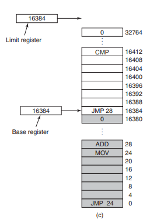
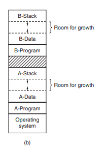

# MEMSIM

## TODO
- Conversar com o professor sobre
- Decidir as tarefas de cada integrante da equipe

- [ ] Simulador
    - [ ] Memória
        - [ ] Definir tamanho da memória.
        - [ ] Array de bytes para acomodar os programas.
        - [ ] Lista sequencial de programas e buracos.
        - [ ] Manipulação de Memória.
            - [ ] Memory Swap (com espaço extra para crescimento de programas).
                - [ ] Salvar estados dos programas.
            - [ ] Shrink.
    - [ ] Programas
        - [ ] Inserção/remoção de bytes no programa.
        - [ ] Interpretação/ação com os bytes.
        - [ ] Todos os programas rodam em sequência na sequência em que estão na memória.
    - [ ] OS (?)
        - [ ] Carregar o OS desde o início como um programa.
        - [ ] Se houver uma linguagem/comandos simples, o OS usará esses comandos (?).
        - [ ] Remover os programas da memória quando acabarem.
        - [ ] Impedir que os programas acessem espaços de memória indevidos.
        - [ ] Fornecer base e limit registers.
        - [ ] Escolher o lugar para os programas na memória.

        
        - [ ] Fazer o OS ser executado tal qual um programa comum (uma vez por ciclo).

- UI

## Interpretação de bytes
Algumas possibilidades para interpretação/ação com bytes:
- Fazer com que cada byte seja um comando (0x00 = print).
    - Seguindo essa ideia, poderíamos criar uma linguagem simples (similar a assembly) para o programa interpretar e roda na memória virtual.
    - Neste sentido, tanto o código quanto os dados seriam carregados na memória, ambos em seções distintas.

- Cada programa tem um header que escolhe como vão mostrar/o que fazer os bytes.